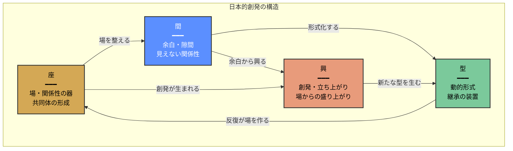
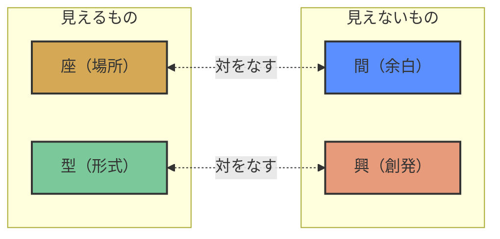
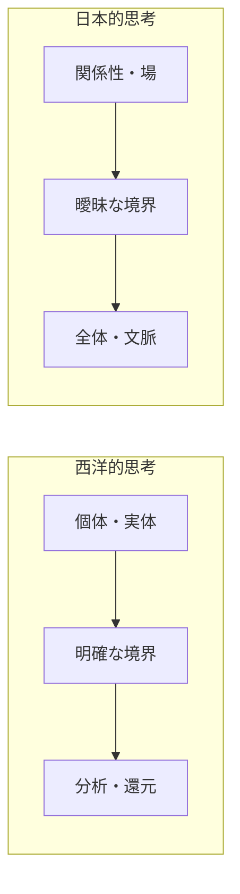

# 座と間 ― 日本的創発の哲学

**関係性から生まれる価値創造の思想**

---

> 「日本という方法」のおおもとには、「間(ま)」と呼ぶ以外にない特有の感覚が横溢しています。
> ― 松岡正剛

---

## 目次

1. [はじめに](#1-はじめに)
2. [「間」とは何か](#2-間とは何か)
3. [「座」とは何か](#3-座とは何か)
4. [「型」と「興」](#4-型と興)
5. [四概念の関係図](#5-四概念の関係図)
6. [哲学的背景](#6-哲学的背景)
7. [日本文化における実践例](#7-日本文化における実践例)
8. [松岡正剛と「日本という方法」](#8-松岡正剛と日本という方法)
9. [現代への応用可能性](#9-現代への応用可能性)
10. [西洋思想との対比](#10-西洋思想との対比)
11. [まとめ：座と間の本質](#11-まとめ座と間の本質)
12. [参考文献・リソース](#12-参考文献リソース)

---

## 1. はじめに

<!-- 🖼 IMAGE: 表紙画像 - 水墨画風の余白と気配 -->

### なぜ今「座と間」なのか

現代のビジネスや組織運営において、私たちは「効率」「最適化」「明確な役割分担」を追求してきました。しかし、複雑化する世界の中で、それだけでは捉えきれない価値創造の形があります。

**イノベーションはどこから生まれるのか？**

それは往々にして、明確に定義された領域の「あいだ」から、予期せぬ出会いの「場」から生まれます。日本文化は、この「あいだ」や「場」を古くから概念化し、大切にしてきました。

本レポートでは、日本文化における四つの核心的概念 ――「**座**」「**間**」「**型**」「**興**」―― を探究し、現代の組織やチームにおける価値創造への示唆を得ることを目的とします。

### 本レポートの構成

- **第2〜4章**：四つの概念それぞれの意味と背景
- **第5章**：四概念の相互関係を図解
- **第6〜8章**：哲学的背景と文化的実践
- **第9〜10章**：現代への応用と西洋思想との対比
- **第11章**：まとめとキーメッセージ

---

## 2. 「間」とは何か

<!-- 🖼 IMAGE: 茶室の間 - 障子から差し込む光、畳、余白 -->

### 2.1 「間」の多層的な意味

「間」（ま / Ma）は、日本文化における最も重要かつ翻訳困難な概念の一つです。英語では "negative space"、"pause"、"interval"、"emptiness" と訳されることがありますが、いずれも「間」の深さと複雑さを完全には捉えきれません。

「間」は以下の三つの次元を包含します：

| 次元 | 説明 | 例 |
|------|------|-----|
| **空間的な間** | 物と物のあいだの空間、余白 | 茶室の余白、書道の白 |
| **時間的な間** | 出来事と出来事のあいだの沈黙、休止 | 能の静止、会話の沈黙 |
| **関係的な間** | 人と人、存在と存在のあいだの関係性 | 人間関係の「間合い」 |

美学者・末利光は『間の美学―日本的表現』（1991年）において、「間」を「**時の間**」「**距離や面の間**」「**得体のしれない間**」の三つに分類しました。

### 2.2 余白は「空き」ではない

西洋的な視点では、何もない空間は単なる「空白」「欠如」と見なされがちです。しかし日本文化において、余白は積極的な意味を持ちます。

> 和室においては、何も置かれていない部分を単に「空いているだけ」とは捉えず、そこにある"余白"こそが、掛け軸や花などの主役を引き立てるために重要な働きをしています。

書道では墨の濃淡と余白の配置が全体のリズムを作り、水墨画では描かれていない「空」が山や水の存在を逆説的に浮かび上がらせます。俳句では17音という極端な短さの中に、読者の想像力を引き出す「間」が存在します。

### 2.3 磯崎新「間（MA）展」

1978年、建築家・磯崎新はパリのルーブル装飾美術館で「**間―日本の時空間**」展を開催しました。この展覧会は、「間」を日本文化論の説明原理として国際的に提示した嚆矢となりました。

展覧会は9つの部屋で構成され、それぞれに日本的概念をテーマとしたタイトルが付けられました：

1. **みちゆき** ― 道行、移行の時空間
2. **すき** ― 隙、好き、数寄
3. **やみ** ― 闇、見えないもの
4. **ひもろぎ** ― 神籬、神が降りる場
5. **はし** ― 橋、端、箸（境界と接続）
6. **うつろい** ― 移ろい、変化
7. **さび** ― 寂、時間の堆積

松岡正剛もこの展覧会にエディトリアル・ディレクターとして参加し、「これは初めて『間』について、また神道空間の本質について考える機会となった」と述べています。

磯崎新にとって「間」とは、抽象化された「**虚**」（老子）につながる概念であり、「ソリッドで永遠で硬いものに対して、はかなくて瞬間的にすぐ消えていくような概念」でした。

---

## 3. 「座」とは何か

<!-- 🖼 IMAGE: 茶会の情景 - 亭主と客、一座建立のイメージ -->

### 3.1 「座」の語源と多義性

「座」という漢字は、形声文字で「广」（建物）＋音符「坐」（すわる）から成り、「すわる場所」「座席」を意味します。しかし日本文化において「座」は、単なる物理的な席を超えた豊かな意味を持ちます。

**「座」の三つの意味層：**

| 層 | 意味 | 例 |
|----|------|-----|
| **物理的な座** | すわる場所、席 | 座席、座布団 |
| **社会的な座** | 集まりの場、同業者組合 | 中世の商工業座、能座 |
| **創発的な座** | 関係性から生まれる場 | 一座建立、場の創発 |

### 3.2 一座建立（いちざこんりゅう）

茶道における「**一座建立**」は、「座」の概念の精髄を表す言葉です。

> 「一座」とは、その場に集まった人々全体を指し、「建立」とは、「何かを共に成り立たせる」という意味を持ちます。

一座建立とは、茶室という限定された空間において、**亭主の周到な準備**と**客の深い理解力**が合致した瞬間に立ち上がる、**一回性の芸術的な共同空間**のことです。

重要なのは、この「座」は亭主が一方的に作るものではなく、**参加者全員によって共に創り上げられる**という点です。物理的な茶室の中に、参加者の心によって目に見えない「座」が建立されるのです。

### 3.3 「一期一会」との関係

「一座建立」は、「**一期一会**」という概念と深く結びついています。

| 概念 | 強調点 | 意味 |
|------|--------|------|
| **一期一会** | 時間の一回性 | この出会いは二度とない、かけがえのないもの |
| **一座建立** | 共同性・主体性 | その場にいる全員が協力して、貴重な時間を創り上げる |

両者は相補的であり、「一期一会」の時間認識が「一座建立」の空間創造を支えています。

### 3.4 歴史的な「座」― 中世の同業者組合

歴史的には、「座」は平安時代から戦国時代まで存在した商工業者・芸能者の同業者組合を指しました。

- 貴族・寺社に金銭を払う代わりに、営業・販売の独占権を認められた
- 「公的な場所における特定の座席」または「同業者の集会の場」に由来
- 地縁的結合による「里座」「町座」も存在

この歴史的な「座」もまた、単なる経済組織ではなく、**関係性の中で価値を生み出す場**としての性格を持っていました。

---

## 4. 「型」と「興」

### 4.1 「型」― 間を継承する動的形式

<!-- 🖼 IMAGE: 能舞台、または武道の型 -->

「**型**」（かた）は、日本文化において「間」を扱い、継承するための動的形式です。

> その目に見えない「間」を動きのある「型(かた)」によって扱いながら、マニュアルにしがたい知や方法を、「家」等の集団の単位で継いできたのが日本である。
> ― 松岡正剛

「型」の特徴：

| 特徴 | 説明 |
|------|------|
| **暗黙知の形式化** | 言葉にしにくい知を身体的形式で伝える |
| **柔軟な固定** | 形を守りつつも、状況に応じた変化を許容 |
| **反復による深化** | 繰り返しの中で本質に近づく |
| **破の契機を内包** | 「守破離」のプロセスを可能にする |

武道、茶道、華道、能楽、職人技――あらゆる日本の伝統において、「型」は単なる形式ではなく、**見えない「間」を見える「動き」に変換する装置**として機能しています。

### 4.2 「興」― 場から立ち上がる創発

「**興**」（きょう / おこる）は、「座」という場から立ち上がる創発・盛り上がりを表す概念です。

**漢字の成り立ち：**
- 「舁」（両手で持ち上げる）＋「同」（共に）
- → **共に持ち上げる、起こす**

**「興」の意味：**

| 読み | 意味 |
|------|------|
| **コウ** | おこる、ふるいたつ、盛んになる、立ち上がる |
| **キョウ** | たのしみ、おもしろみ（興味、興趣） |

「興」は、場の中から**自然発生的に立ち上がってくるもの**を指します。計画や設計によって作り出すのではなく、適切な「座」が整い、「間」が生きているときに、**おのずから興ってくる**ものです。

### 4.3 神事芸能における「興」

日本の芸能は、神事を母胎として発展しました。

> 日本の芸能は村々における神祭りの場を母胎とした。黎明期の芸能はシャーマニズム儀礼の形をとっていたと考えられている。

神楽や祭りにおいて、神をもてなす「座」が整えられ、そこから歌舞音曲が「興る」。この構造は、現代の私たちが「場の盛り上がり」「チームの一体感」「創発的なアイデア」と呼ぶものの原型と言えます。

### 4.4 「座興」という言葉

「**座興**」（ざきょう）という言葉は、「座」と「興」の関係を端的に表しています。

- 宴席などで、その場に興を添えるための芸や遊戯
- その場限りの戯れごと、ちょっとした冗談

「座興」は軽い意味で使われることが多いですが、その本質は**場（座）から自然に生まれる楽しみ（興）**を指しています。

---

## 5. 四概念の関係図

### 5.1 座・間・型・興の相互関係



### 5.2 循環する四概念

四つの概念は、以下のように循環的な関係にあります：

```
    ┌─────────────────────────────────┐
    │                                 │
    ▼                                 │
   座（場を整える）                    │
    │                                 │
    ▼                                 │
   間（余白を生かす）                  │
    │                                 │
    ▼                                 │
   興（創発が起こる）                  │
    │                                 │
    ▼                                 │
   型（形式として継承）────────────────┘
```

1. **座**を整える → 関係性の器を作る
2. **間**を生かす → 余白・隙間を大切にする
3. **興**が起こる → 場から創発が生まれる
4. **型**として継承 → 創発を形式化し、次の座を作る基盤とする

### 5.3 対比構造



| 軸 | 見えるもの | 見えないもの |
|----|-----------|-------------|
| **場** | 座（物理的・社会的な場所） | 間（関係性・余白） |
| **動き** | 型（形式化された動作） | 興（自然発生的な創発） |

---

## 6. 哲学的背景

### 6.1 西田幾多郎「場所の論理」

<!-- 🖼 IMAGE: 書道風の「無」の文字、または禅的な円相 -->

日本哲学における「座」「場」の概念を体系化したのが、京都学派の創始者・**西田幾多郎**（1870-1945）です。

西田は1927年の著作『働くものから見るものへ』において、「**場所の論理**」を提唱しました。

> 「場所の論理」とは、存在するもの全ては「於いてある場所」があるという論理です。

**西田哲学のキーポイント：**

| 概念 | 説明 |
|------|------|
| **場所** | 存在が「於いてある」ところ。主語ではなく述語の位置 |
| **絶対無の場所** | あらゆる有を包む究極の場所。無でありながら有を成立させる |
| **述語の論理** | 西洋の主語中心の論理に対し、述語（場所）を重視する論理 |

西田が「場所」を重視したのは、ヨーロッパの「**有の哲学**」から東洋の「**無の哲学**」に向かうには、「於いて有る」の「**於いて**」に着目しなければならないと気づいたからでした。

### 6.2 清水博「場の思想」

生命科学者・**清水博**（1932-）は、西田哲学を現代に発展させ、「**場の思想**」を提唱しました。

著書『場の思想』（東京大学出版会、2003年）において、清水は以下のように述べています：

> 「複雑系としての生命」から「自己」が生まれ、「自己」と「他者」の出会いから、自己組織現象としての「場」がつくられる。

**清水の場の理論の特徴：**

- **場の考え方は東洋特有**：西洋の近代科学が全体を要素に還元するのに対し、東洋では個はつねに全体の中に位置づけられる
- **縁起論的生成**：個と個の出会いから場が生成される
- **一期一会の文化**：「一期一会の出会いの文化こそ日本の文化の特徴である」

清水の思想は、茶道の「一座建立」や、チーム・組織における創発を理論的に説明する枠組みを提供しています。

### 6.3 和辻哲郎「間柄」の倫理学

倫理学者・**和辻哲郎**（1889-1960）は、西洋の個人主義的倫理学を批判し、「**間柄**」を軸とした独自の倫理学を展開しました。

> 人間は独立した存在ではなく関係的存在である。個人的・社会的存在は自身が個人であることと社会の成員であることの両方を自覚すべきだ。

和辻にとって「人間」という言葉自体が、「人」と「人」の「間」を意味しています。存在は孤立した個体ではなく、**関係性の中でこそ成立する**という洞察は、「座」と「間」の哲学的基盤を提供しています。

---

## 7. 日本文化における実践例

### 7.1 茶道 ― 一座建立の空間

<!-- 🖼 IMAGE: 茶室内部、待庵のような小さな空間 -->

千利休が作った「**待庵**」は、わずか二畳と床の間という極小の空間です。しかしこの小さな茶室の中に、亭主と客が各々の精神世界を交わせ、**一個の小宇宙**を作り出しました。

**茶室における「座と間」：**

| 要素 | 座と間の表れ |
|------|-------------|
| **床の間** | 主題を示す「間」、精神世界への入口 |
| **躙口（にじりぐち）** | 身分を超えて平等に入る「座」の入口 |
| **点前座と客座** | 亭主と客の関係性を規定する「間」 |
| **沈黙** | 言葉の「間」が生む深い交流 |

茶の湯において、床の間は単なる飾り棚ではありません。武家社会では身分を示す目的で作られた床の間が、茶の湯においては**浮世の人間関係を超越した精神世界**を作り出すための装置となりました。

### 7.2 能楽 ― 動と静の間

能の舞台では、演者が動きを止めて一瞬沈黙する「**間**」があるからこそ、次の詞や所作が研ぎ澄まされた印象を与えます。

> 役者があえて動きを止める"間"こそが観客の心を揺さぶり、次に展開される所作や言葉を強烈に印象づけるのです。

能における「座と間」：

- **橋掛かり**：現世と異界を結ぶ「間」の空間
- **シテとワキ**：主役と脇役の関係性が作る「座」
- **囃子の間**：音と沈黙が織りなすリズム

### 7.3 日本建築 ― 連続する空間

<!-- 🖼 IMAGE: 障子、縁側、中庭のある日本家屋 -->

日本建築の特徴として「**連続する空間性**」がよく挙げられます。

> 畳や障子によるモジュール構成で、壁を撤去・開放して縁側や中庭を取り込み、内部と外部が連続する状態を作り出します。

**日本建築における「間」：**

| 要素 | 説明 |
|------|------|
| **障子** | 光を通しながら空間を柔らかく区切る |
| **襖** | 開け閉めで空間の関係性を変える |
| **縁側** | 内と外の「間」、曖昧な境界 |
| **中庭** | 建物の中にある「外」、余白 |

井上充夫は『日本建築の空間』において、日本人の建築観が**実体的なもの**から**空間的なもの**へ変遷していったと論じています。古代の日本人の関心は「柱」などの実体にありましたが、次第に空間や間隙への関心が高まっていきました。

### 7.4 職人技 ― 型の継承

日本の職人文化において、技術は**型**を通じて継承されます。

- **守破離**：型を守り、型を破り、型を離れる
- **見て盗む**：言葉ではなく、観察と実践で学ぶ
- **家元制度**：座（共同体）の中での継承

職人の「型」は、マニュアル化できない暗黙知を、身体的な形式を通じて次世代に伝える装置です。そこには言葉にならない「間」が詰まっています。

---

## 8. 松岡正剛と「日本という方法」

### 8.1 編集工学という視座

<!-- 🖼 IMAGE: 書物が積み重なるイメージ、または編集のメタファー -->

**松岡正剛**（1944-2024）は、「**編集工学**」を創始し、日本文化、生命科学、デザイン、文字文化など多方面の研究成果を「編集」という視座から統合しました。

松岡にとって「編集」とは、単なる文章の整理ではなく、**世界を読み解き、再構成する方法**そのものです。

### 8.2 「日本という方法」

松岡は著書『日本という方法―おもかげ・うつろいの文化』において、日本文化の核心を「**おもかげ**」と「**うつろい**」というキーワードで捉えました。

> 「日本という方法」とは、世界の「別様（コンティンジェント＝偶有的なるもの）」としての日本的思考法である。

松岡の「日本という方法」は、西洋的な普遍主義や合理主義に対する**別の可能性**を提示するものです。

### 8.3 AIDA「座と興のAIDA」

松岡が座長を務めた Hyper-Editing Platform「**AIDA**」では、「日本という方法」を3年計画で探究するプログラムが進行しています。

| シーズン | テーマ | 焦点 |
|---------|--------|------|
| Season 5 | 型と間のAIDA | 「間」を「型」で扱う日本的方法 |
| Season 6 | 座と興のAIDA | 関係性の中で生まれる創発 |

Season 6「座と興のAIDA」では、以下のテーマが探究されています：

> 「合理性や論理性では解ききれない相互編集の中にある創発性」に焦点を当て、日本の場の文化における「**一座建立・一味同心**」の編集的可能性を体感する。

### 8.4 「間（MA）展」への参加

松岡正剛は、1978年の磯崎新「間（MA）展」にエディトリアル・ディレクターとして参加しました。この経験が、後の「日本という方法」の探究につながっています。

> これは初めて『間』について、また神道空間の本質について考える機会となった。

---

## 9. 現代への応用可能性

### 9.1 チーム・組織への示唆

「座と間」の思想は、現代のチームや組織運営に重要な示唆を与えます。

**「座」の観点から：**

| 従来の発想 | 「座」的発想 |
|-----------|-------------|
| リーダーが場を作る | 全員で場を創り上げる |
| 役割を明確に分ける | 関係性の中で役割が生まれる |
| 効率的なコミュニケーション | 余白のあるコミュニケーション |

**「間」の観点から：**

| 従来の発想 | 「間」的発想 |
|-----------|-------------|
| 隙間を埋める | 余白を生かす |
| 常に何かをする | 沈黙・休止を大切にする |
| 明確に言語化する | 言葉にならないものを大切にする |

### 9.2 イノベーションと創発

「興」の概念は、イノベーションの本質を捉える視点を提供します。

> イノベーションは、計画や設計によって作り出すものではなく、適切な「座」が整い、「間」が生きているときに、**おのずから興ってくる**ものである。

**創発を促す条件：**

1. **適切な「座」を整える** ― 多様な人が安心して参加できる場
2. **「間」を生かす** ― 詰め込みすぎない、余白を残す
3. **「型」を共有する** ― 共通の言語・作法・プロトコル
4. **「興」を待つ** ― 焦らず、自然な盛り上がりを待つ

### 9.3 実践のヒント

**会議・ミーティングにおいて：**

- アジェンダに「余白の時間」を設ける
- 沈黙を恐れない
- 「場を温める」時間を大切にする
- 全員が「場を作る主体」であることを意識する

**プロジェクト運営において：**

- 「型」（共通のプロセス・儀式）を作る
- 定期的に「一座建立」の場を設ける
- 偶発的な出会いの余地を残す
- 「興った」アイデアを大切にする

---

## 10. 西洋思想との対比

### 10.1 実体 vs 関係性



| 観点 | 西洋的思考 | 日本的思考 |
|------|-----------|-----------|
| **存在の捉え方** | 個体・実体中心 | 関係性・場中心 |
| **境界** | 明確に区切る | 曖昧に溶け合う |
| **空間の意味** | 充填すべき空白 | 積極的な余白 |
| **時間の意味** | 直線的・目的志向 | 循環的・プロセス重視 |
| **知の伝達** | 言語化・マニュアル化 | 型・身体・暗黙知 |

### 10.2 「有の哲学」と「無の哲学」

西田幾多郎が指摘したように、西洋哲学は「**有の哲学**」、東洋哲学は「**無の哲学**」という傾向があります。

**西洋（有の哲学）：**
- 存在するもの（有）を出発点とする
- 「何があるか」を問う
- 主語中心の論理

**東洋（無の哲学）：**
- 存在の根底にある無を見る
- 「どこに於いてあるか」を問う
- 述語（場所）中心の論理

### 10.3 相補的な関係

重要なのは、西洋的思考と日本的思考を**対立**として捉えるのではなく、**相補的**なものとして捉えることです。

> 松岡正剛は「世界のお手本ではなく『別様』であることが『日本という方法』なのかもしれない」と述べている。

「座と間」の思想は、西洋的な合理性・効率性を否定するものではありません。むしろ、それだけでは捉えきれない価値創造の可能性を開くものです。

---

## 11. まとめ：座と間の本質

### 11.1 四概念の要約

| 概念 | 本質 | キーワード |
|------|------|-----------|
| **座** | 関係性が生まれる場、共同体の器 | 一座建立、場所、共創 |
| **間** | 余白・隙間・見えない関係性 | 余白、沈黙、あいだ |
| **型** | 間を継承する動的形式 | 守破離、暗黙知、身体 |
| **興** | 場から立ち上がる創発 | おこる、盛り上がり、創発 |

### 11.2 三つのキーメッセージ

**1. 余白には力がある**

「間」は単なる空白ではありません。適切な余白があるからこそ、主役が引き立ち、想像力が働き、創発が生まれます。詰め込みすぎない勇気を持つこと。

**2. 場は全員で創る**

「座」は誰か一人が作るものではありません。「一座建立」のように、その場にいる全員が主体的に参加することで、はじめて生きた場が生まれます。

**3. 創発は待つもの**

「興」は計画して作り出すものではありません。適切な座を整え、間を生かし、型を共有したとき、おのずから興ってくるものです。焦らず、待つ姿勢が大切です。

### 11.3 「座と間」が指し示すもの

「座と間」は、日本文化における**関係性と創発の哲学**を表現しています。

それは、西洋的な「個体・実体中心」の思考に対し、**関係性・余白・共創・創発**を重視する世界観です。

この思想は、伝統文化の中だけでなく、現代のチーム運営、組織開発、イノベーション創出においても、重要な示唆を与えてくれます。

---

## 12. 参考文献・リソース

### 書籍

| 書籍 | 著者 | 出版社 | 年 |
|------|------|--------|-----|
| 『日本建築の空間』 | 井上充夫 | 鹿島出版会（SD選書） | 1969 |
| 『間の美学―日本的表現』 | 末利光 | - | 1991 |
| 『間の研究―日本人の美的表現』 | 南博 | - | 1983 |
| 『場の思想』 | 清水博 | 東京大学出版会 | 2003 |
| 『生命知としての場の論理』 | 清水博 | 中公新書 | 1996 |
| 『日本という方法』 | 松岡正剛 | NHKブックス / 角川ソフィア文庫 | 2006 |
| 『働くものから見るものへ』 | 西田幾多郎 | 岩波書店 | 1927 |

### Webリソース

- [AIDA Season 6「座と興のAIDA」](https://www.eel.co.jp/aida/news/season6_announce/)
- [AIDA Season 5「型と間のAIDA」閉幕](https://www.eel.co.jp/aida/news/season5_theme/)
- [松岡正剛の千夜千冊](https://1000ya.isis.ne.jp)
- [磯崎新「間」展について](https://db.10plus1.jp/backnumber/article/articleid/1464/)
- [一座建立の概念（note）](https://note.com/yoshitaka0115/n/nebff9f849d93)
- [「間」の美学について（note）](https://note.com/kgraph_/n/n7d5332c8f488)
- [西田幾多郎「場所の論理」](https://kotobank.jp/word/%E5%A0%B4%E6%89%80%E3%81%AE%E8%AB%96%E7%90%86-114295)

---

## 付録：AI画像生成プロンプト

本レポートで使用する和風イラストを生成するためのプロンプト集です。

### 表紙画像
```
A minimalist Japanese ink wash painting (sumi-e style) depicting
the concept of "Ma" (negative space). Subtle brushstrokes suggesting
mountains or mist emerging from vast white space. Monochromatic,
contemplative atmosphere. Traditional washi paper texture.
Aspect ratio 16:9, high resolution.
```

### 茶室の「間」
```
Interior of a traditional Japanese tea room (chashitsu), soft light
filtering through shoji screens. Tatami mats, tokonoma alcove with
a single hanging scroll. Emphasis on empty space and subtle shadows.
Warm, meditative atmosphere. Photorealistic or watercolor style.
```

### 一座建立
```
A serene Japanese tea ceremony scene, host and guests in harmony.
Traditional kimono, subtle movements, steam rising from tea bowl.
Soft, diffused lighting. Emphasis on the spiritual connection between
participants. Watercolor or traditional Japanese painting style.
```

### 能舞台
```
A Noh theater stage with a single performer in moment of stillness (ma).
Traditional pine tree backdrop (kagami-ita). Dramatic lighting creating
shadows. Sense of suspended time and spiritual presence.
Traditional Japanese art style or dramatic photography.
```

### 余白の書
```
Japanese calligraphy (shodo) on white paper, showing the character
for "Ma" (間) or "Mu" (無). Bold black ink strokes with intentional
white space. Traditional brush technique visible. Minimalist,
contemplative composition.
```

---

*本レポートは「座と間」の概念を社内共有用にまとめたものです。*
*作成日：2026年4月*
